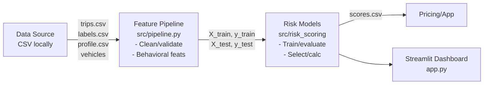

# Telemetra — Telematics-Based Auto Insurance

End-to-end system that converts raw GPS/accelerometer trips into driver-level behavioral features, trains leak-safe models to predict claims risk, and exports calibrated 0–100 risk scores for pricing and a Streamlit dashboard.

## 📁 Project Structure

```
.
├── src/
│   ├── simulations.py
│   ├── make_area_h3.py
│   ├── pipeline.py               # BehavioralRiskPipeline + feature engineering
│   ├── risk_scoring.py           # Models (LogReg, RandomForest, optional XGBoost)
│   └── risk_scoring_run.py       # Orchestrates pipeline → modeling → scores
│   └── pricing_engine.py         # Calculating insurance premiums given the trained models
│   └── price_engine_run.py         
├── app.py                        # Streamlit dashboard (local CSVs only)
├── data/                         # Place input CSVs here
├── outputs/                      # Scores, features, reports (created)
└── models/                       # Saved models & preprocessors (created)
```

## 🏗️ System Architecture



## ✨ Key Design Points

- **Predict claims outcomes** (classification; optional severity), not circular synthetic scores
- **Leakage control**: Split by driver before fitting; encoders/scalers fit on train only
- **Robust features** from trip telemetry: speeding, hard events, context (night/rush, weather), events/100 km, plus optional profile/vehicle signals
- **Works offline** with CSVs; dashboard provides synthetic fallback if models aren't trained yet

## 📋 Data Contract (CSV Schema)

Put files in `./data/`. **IDs must be strings** to avoid merge/type bugs.

| File | Required? | Key Columns |
|------|-----------|-------------|
| `trips.csv` | ✅ | `user_id`, `trip_id`, `speed`, `limit`, `accel`, `hour`, `rain`, `lat`, `lon` |
| `trip_labels.csv` | optional | `trip_id`, `claim` (0/1), `severity` (float) |
| `driver_profile.csv` | optional | `user_id`, `first_name`, `last_name`, `gender`, `age`, `prior_claims_count`, `tickets_count`, `annual_mileage_declared` |
| `vehicle_assignments.csv` | optional | `user_id`, `vehicle_id` |
| `vehicle_info.csv` | optional | `vehicle_id`, `year`, `make`, `model`, `airbags`, `sensors`, `safety_features_count` |
| `area_context.csv` | optional | Any grid/zone context you want to join later |

### Recommended Loading (Type Safety)

```python
pd.read_csv("data/trips.csv", dtype={"user_id": str, "trip_id": str})
pd.read_csv("data/trip_labels.csv", dtype={"trip_id": str})
pd.read_csv("data/driver_profile.csv", dtype={"user_id": str})
pd.read_csv("data/vehicle_assignments.csv", dtype={"user_id": str, "vehicle_id": str})
pd.read_csv("data/vehicle_info.csv", dtype={"vehicle_id": str})
```

## 🎯 Features (Pipeline Generated)

### Speed Behavior
- % over limit, % excess (>120% of limit)
- Mean/max/variance, speed/cv

### Aggressive Events
- Hard accel/brake rates
- Brake flag frequency

### Context
- Fractions of night and rush hour
- Adverse weather exposure

### Exposure Normalization
- Events per 100 km (stable across sampling)

### Trip Stats
- Number of trips
- (Optional) km total, hour distribution

### Optional Enrichments
- Driver age/experience buckets
- Vehicle safety score

### Targets (if labels exist)
- `has_claim` (driver-level rollup of trip_labels)
- Optional `total_severity` regressor trained only on claimants

## 📚 Complete Runbook

### 0. One-time Setup
```bash
# from repo root
python -m venv .venv
source .venv/bin/activate          # Windows: .venv\Scripts\activate
pip install -r requirements.txt    # or: pip install pandas numpy scikit-learn joblib streamlit altair xgboost h3
mkdir -p data outputs models
```

**Important:** All IDs are handled as strings. When you add/replace CSVs, keep `user_id`, `trip_id`, `vehicle_id` as text, not numeric.

### 1. Simulate Trips
Generates raw telemetry (trips) and basic profiles so you can run the rest of the stack locally.

```bash
python src/simulations.py \
  --drivers 100 \
  --days 30 \
  --outdir data \
  --seed 42
```

**Expected outputs** (under `data/`):
- `trips.csv` (user_id, trip_id, speed, accel, limit, hour, rain, lat, lon, …)
- `driver_profile.csv`
- `vehicle_assignments.csv`
- `vehicle_info.csv`
- (optionally) `trip_labels.csv` if your simulation emits claims

**Quick sanity check:**
```bash
python - <<'PY'
import pandas as pd; d=pd.read_csv('data/trips.csv', nrows=5, dtype={'user_id':str,'trip_id':str}); print(d.head())
PY
```

### 2. Build Area Grid (H3) & Context
Joins trips to area cells; produces `area_context.csv` you can use downstream.

```bash
python src/make_area_h3.py \
  --trips data/trips.csv \
  --out data/area_context.csv \
  --h3_res 8
```

**Expected outputs:**
- `data/area_context.csv` (h3_cell, agg stats; optional joins to external risk layers)

### 3. Feature Pipeline
Creates behavior features and leak-safe train/test partitions.

```bash
python src/pipeline.py \
  --data_dir ./data \
  --min_trips_per_driver 5 \
  --test_size 0.25
```

**Expected outputs:**
- `outputs/engineered_features_*.csv` (one row per driver)
- `outputs/pipeline_metadata_*.json` (config + shapes)
- (prints) label distribution, train/test sizes

### 4. Risk Modeling + Scoring
Trains models (LogReg/RandomForest/optional XGBoost), evaluates, and exports calibrated 0–100 risk scores.

```bash
python src/risk_scoring_run.py
```

**Expected outputs:**
- `outputs/behavioral_risk_scores.csv` ← this is the file the app can read
- `models/*` (best model + preprocessors)
- `outputs/model_performance_summary_*.json`
- `outputs/engineered_features_*.csv` (re-exported if configured)

**Make the scores available to the app:**
```bash
cp outputs/behavioral_risk_scores.csv data/behavioral_risk_scores.csv
```

### 5. Price Engine (Illustrative Premiums)
Computes a simple premium using risk + behavior surcharges (cap applied).

```bash
python src/price_engine_run.py \
  --scores data/behavioral_risk_scores.csv \
  --features outputs/engineered_features_*.csv \
  --base_premium 600 \
  --out outputs/premiums.csv
```

**Expected outputs:**
- `outputs/premiums.csv` (driver_id, risk_score, premium, tier, …)

### 6. Streamlit App
Visual dashboard. Works with model scores (preferred) or falls back to a synthetic risk proxy if no scores file is present.

```bash
streamlit run app.py
```

- **Default data folder:** `./data`
- **App expects (at minimum):** `data/trips.csv`
- **If present, it auto-loads:** `data/behavioral_risk_scores.csv`

You can point the app at a different folder in the sidebar.

### One-liner for Local Demo

```bash
source .venv/bin/activate && \
python src/simulations.py --drivers 100 --days 30 --outdir data --seed 42 && \
python src/make_area_h3.py --trips data/trips.csv --out data/area_context.csv --h3_res 8 && \
python src/pipeline.py --data_dir ./data --min_trips_per_driver 5 --test_size 0.25 && \
python src/risk_scoring_run.py && \
cp outputs/behavioral_risk_scores.csv data/behavioral_risk_scores.csv && \
python src/price_engine_run.py --scores data/behavioral_risk_scores.csv --features outputs/engineered_features_*.csv --base_premium 600 --out outputs/premiums.csv && \
streamlit run app.py
```

## 🔍 Verification After Each Step

- **After simulations:** `data/trips.csv` has ≥100k rows for 100 drivers over a month; `user_id`/`trip_id` are strings
- **After make_area_h3:** `data/area_context.csv` row count roughly equals unique H3 cells touched
- **After pipeline:** Console shows something like `Train shape: (75, …) | Test shape: (25, …)`; no degenerate labels if you simulated claims
- **After risk_scoring_run:** `outputs/behavioral_risk_scores.csv` exists and has columns: `driver_id`, `risk_probability`, `risk_score`, `risk_category`
- **After price_engine_run:** `outputs/premiums.csv` exists with reasonable values (no negative premiums, cap respected)

## 🚨 Common Pitfalls & Quick Fixes

### Merge dtype error on driver_id
Always read/write IDs as text:
```python
pd.read_csv(..., dtype={"user_id": str, "trip_id": str, "vehicle_id": str})
```

### App can't find scores
Make sure the exact path is `data/behavioral_risk_scores.csv` (case-sensitive).
If you only see synthetic risk in the app, copy the file:
```bash
cp outputs/behavioral_risk_scores.csv data/behavioral_risk_scores.csv
```

### Read-only filesystem (e.g., /data)
Our scripts write to project-relative folders (`./data`, `./outputs`, `./models`). Don't override them to system paths.

### XGBoost missing
We fall back to LogReg + RF. To enable: `pip install xgboost`

## 🔐 Security & Privacy (Essentials)

- Keep `driver_profile.csv` minimal; avoid sensitive attributes for modeling unless approved & governed
- Treat all outputs in `./outputs` as confidential; they contain risk and possibly PII joins
- Add role-based access and encryption at rest/in transit when deploying beyond local

## 📈 Streamlit Dashboard Features

### KPIs per Driver
- Risk %, category, event rates, predicted premium

### Visualizations
- Speed distribution
- Speed vs limit (recent)
- Hour-of-day patterns
- Event rates
- Map: sampled lat/lon if present

### Premium Sandbox
- Adjust weights and view premium impact instantly

### Leaderboards
- Lowest risk
- Best behavior

**Data Source:** `data/behavioral_risk_scores.csv` (normalized via `ensure_risk_columns()`)

## 💰 Pricing Prototype (Illustrative)

```
predicted_premium = base * (1 + w_r*risk + w_n*night + w_a*adverse + w_e*excess)
```

Weights are adjustable in the app sidebar. **Note:** This is not a filed rate; it demonstrates how risk feeds pricing.

## 🛠️ Troubleshooting

### Merge Type Mismatch on driver_id
```
ValueError: merge on object and int64 columns for key 'driver_id'
```

**Fix:** Cast IDs before any merge or export:
```python
df["user_id"] = df["user_id"].astype(str)
df["trip_id"] = df["trip_id"].astype(str)
scores["driver_id"] = scores["driver_id"].astype(str)
```

### Read-only Filesystem (e.g., /data)
If you see `Errno 30 Read-only file system: '/data'`, you're writing to a protected path.
All scripts use project-relative paths (`./data`, `./outputs`, `./models`). Keep it that way.

### No behavioral_risk_scores.csv
The app will use synthetic risk automatically.

To use model scores:
```bash
python src/risk_scoring_run.py
cp outputs/behavioral_risk_scores.csv data/behavioral_risk_scores.csv
```

### XGBoost Missing
We degrade to LogReg + RF.
Install to enable: `pip install xgboost`

## ✅ Validation Checklist

- [ ] **Class balance:** Is there enough positives to learn? (Runner prints label distribution)
- [ ] **Leakage:** Train/valid split is by driver, not by row
- [ ] **Encoding & scaling:** Fit on train only (handled by pipeline/models)
- [ ] **Sanity of importances:** Excess speed/hard events should rank high
- [ ] **Calibration (optional):** Consider Platt/Isotonic if used for pricing

## 🗺️ Roadmap & Future Work

### Temporal Forecasting
- Lookback window (e.g., last 90 days) → predict next 180 days
- Enforce time-based cutoff

### Calibration
- CalibratedClassifierCV, calibration curves, Brier score
- Make probabilities pricing-grade

### Distance & Routing
- Haversine distance per trip
- (Optional) map-matching, route risk exposure to known hotspots

### Streaming
- Kafka ingest → Spark/Flink jobs compute online features
- Feature Store (e.g., Feast) for offline/online parity

### Cloud
- S3 data lake
- Serverless/containers for scoring API
- CI/CD with model registry (MLflow)

### Governance
- Drift detection
- Periodic backtests
- Fairness auditing
- Monotone constraints where appropriate

